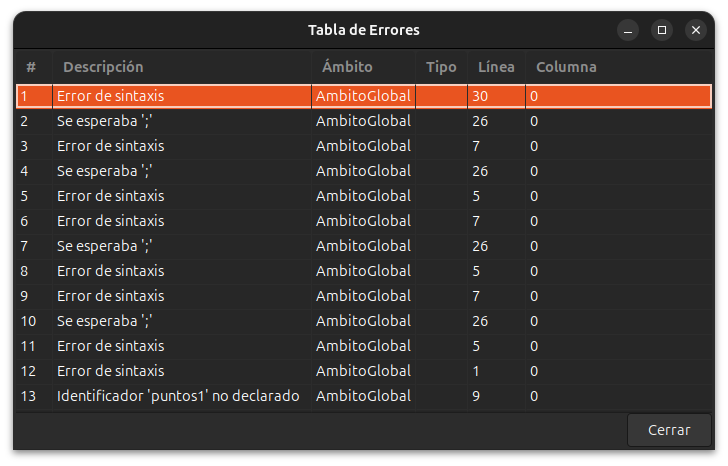

  <h1 style="margin:0 0 8px 0">JavaLang Interpreter</h1>
  <h3 style="margin:0 0 16px 0">Manual de Usuario</h3>
  
Universidad San Carlos de Guatemala — Facultad de Ingeniería

  
Organización de Lenguajes y Compiladores 2

  
<b>Autor:</b> Juan Esteban Chacón Trampe — 202300431

  
<b>Título del Proyecto:</b> JavaLang Interpreter

---

## Introducción

Este manual guía al usuario en la instalación y uso del JavaLang Interpreter con archivos .usl. Explica cómo editar, guardar y ejecutar programas desde la GUI, así como interpretar los reportes de AST, tabla de símbolos y errores. Está orientado a estudiantes del curso OLC2 y asume un entorno Linux con las dependencias indicadas.

## 1. Requisitos e instalación

- Linux con GCC, Flex, Bison, GTK+3 y Graphviz (opcional) instalados.
- Clonar el repositorio y compilar:
  - make
  - make all editor (o tarea preconfigurada en VS Code)

## 2. Archivos USL (.usl)

- Los programas se editan en archivos con extensión .usl.
- Soporta literales (int, float, boolean, char, string, null), control (if/else, while, for, switch) y funciones builtin como String.valueOf.

## 3. Uso del editor GTK

- Ejecutar el editor: make run-editor o ./build/editor
- Atajos:
  - Ctrl+O abrir, Ctrl+S guardar
  - F5 ejecutar, F6 generar AST, F9 errores, F10 símbolos
- Paneles:
  - Editor: edición del código .usl
  - Consola: salida de la ejecución (stdout + stderr combinados)

  

## 4. Ejecutar y ver resultados

1) Escribe tu código en el panel superior.  
            
2) Guarda el archivo si lo deseas (Ctrl+S).  

3) Presiona F5.  
4) La salida aparece en la consola inferior.

Notas:
- La GUI normaliza la salida a UTF‑8 para evitar errores de codificación.
- La semántica de ejecución es la misma que por CLI.

## 5. Reportes: AST, Tabla de Errores y Símbolos

- AST (F6): genera un .dot en carpeta reportes/ y un PNG si está dot instalado. Se abre un visor en la GUI.

- Errores (F9): muestra una tabla parseada de líneas con prefijo ERR|emitidas por el intérprete.

  - Formato: ERR|descripcion|ambito|linea|columna|tipo

  
- Símbolos (F10): tabla a partir de líneas con prefijo SYM|
  - Formato: SYM|id|clase|tipo|ambito|linea|columna
  

## 7. Solución de problemas

- No existe ./build/calc: compila con `make`.
- Errores de GTK-CRITICAL: la GUI ya normaliza UTF‑8; si persisten, revisa literales char (usar \uXXXX correctos).
- AST sin PNG: instala Graphviz (dot) o revisa permisos de la carpeta reportes.
